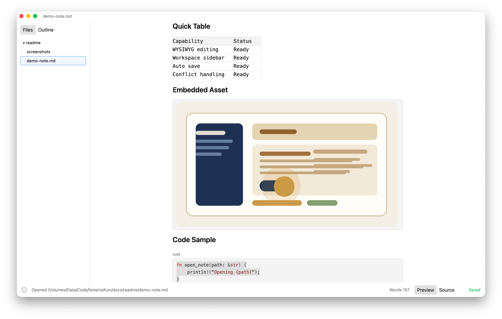

# Vellum

[English](./README.md)

Vellum 是一个基于 Rust 和 `gpui` 的桌面 Markdown 编辑器。它还支持使用 MoonBit 编写扩展！



---

## 当前功能

- ✅ 所见即所得 Markdown 编辑
- ✅ 打开 Markdown 文件或整个文件夹
- ✅ 块级预览与编辑切换
- ✅ 自动保存
- ✅ 工作区侧边栏
- ✅ 监听文件外部变更、删除、重命名
- ✅ 冲突提示与处理
- ✅ 启动时恢复上次打开的文件
- ✅ 使用 WASM 组件模型的扩展支持
- ✅ MoonBit 扩展开发
- ✅ 声明式 UI 的扩展面板
- ✅ 扩展命令
- ✅ 扩展定时器

---

## 技术栈

### 核心应用

- [Rust](https://www.rust-lang.org/)
- [gpui](https://github.com/zed-industries/zed/tree/main/crates/gpui) - UI 框架
- [gpui-components](https://github.com/longbridge/gpui-component) - UI 组件库

### 扩展系统

- [Wasmtime](https://wasmtime.dev/) - WASM 运行时
- [WIT](https://component-model.bytecodealliance.org/) - 接口类型
- [MoonBit](https://www.moonbitlang.com/) - 扩展语言

---

## 快速开始

### 1. 前置要求

- [Rust 工具链](https://rust-lang.org/tools/install)
- 系统依赖（见 [构建指南](./docs/building.md)）

### 2. 构建和运行

```bash
# 克隆仓库
git clone https://github.com/your-org/vellum.git
cd vellum

# 构建
cargo build

# 运行
cargo run
```

---

## 项目结构

```
vellum/
├── crates/                          # Rust 包
│   ├── vellum/                      # 应用入口
│   ├── editor/                      # 编辑器核心
│   ├── workspace/                   # 工作区管理
│   ├── extension/                   # 扩展宿主
│   ├── extension-sdk/               # 扩展 SDK
│   └── gpui-adapter/                # MoonBit GUI 的 GPUI 适配器
├── examples-extensions/             # 示例扩展
│   ├── pomodoro/                    # 番茄钟扩展示例
│   └── moonbit-gui/                 # MoonBit GUI 扩展示例
├── moonbit/                         # MoonBit 模块
│   └── vellum-gui-sdk/              # MoonBit GUI SDK
├── docs/                            # 文档
│   ├── architecture.md              # 架构概述
│   ├── building.md                  # 构建与运行指南
│   ├── gui-framework-guide.md       # GUI 框架指南
│   └── moonbit-extension-guide.md   # MoonBit 扩展指南
├── Cargo.toml
└── README.md
```

---

## 文档

| 文档 | 用途 |
|----------|---------|
| [构建指南](./docs/building.md) | 如何构建和运行项目 |
| [架构概述](./docs/architecture.md) | 项目架构、模块和设计 |
| [GUI 框架指南](./docs/gui-framework-guide.md) | 如何使用 MoonBit GUI 框架 |
| [MoonBit 扩展指南](./docs/moonbit-extension-guide.md) | 如何用 MoonBit 编写扩展 |
| [番茄钟示例](./examples-extensions/pomodoro/) | 完整功能的扩展示例 |
| [MoonBit GUI 示例](./examples-extensions/moonbit-gui/) | 简单 GUI 扩展示例 |

---

## 运行

```bash
cargo run
```

或者生产模式：

```bash
cargo run --release
```

更多详情，见 [构建指南](./docs/building.md)。

---

## 测试

```bash
cargo check
cargo test -p editor
cargo test -p workspace
```

---

## 构建示例扩展

### 番茄钟扩展

```bash
cd examples-extensions/pomodoro
./build.sh
cd ../../
cargo run
```

### MoonBit GUI 扩展

```bash
cd examples-extensions/moonbit-gui
./build.sh
cd ../../
cargo run
```

详细说明，见 [构建指南](./docs/building.md)。

---

## 说明

- 侧边栏目前只显示 `.md`、`.markdown`、`.mdown`
- `Enter` 会对段落、列表、引用等块执行语义化换行
- 代码块保持普通多行编辑
- 当前是单窗口、单文档模型

---

## 贡献

欢迎贡献！请：

1. Fork 仓库
2. 创建功能分支
3. 进行修改
4. 提交 PR

---

## 许可证

本项目遵循与 Vellum 相同的许可证。

---

## 致谢

感谢以下项目和社区：

- [gpui](https://github.com/zed-industries/zed)
- [gpui-components](https://github.com/longbridge/gpui-component)
- [Wasmtime](https://wasmtime.dev/)
- [MoonBit](https://www.moonbitlang.com/)

