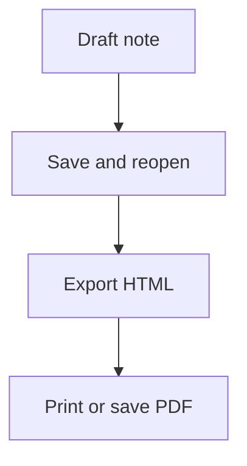
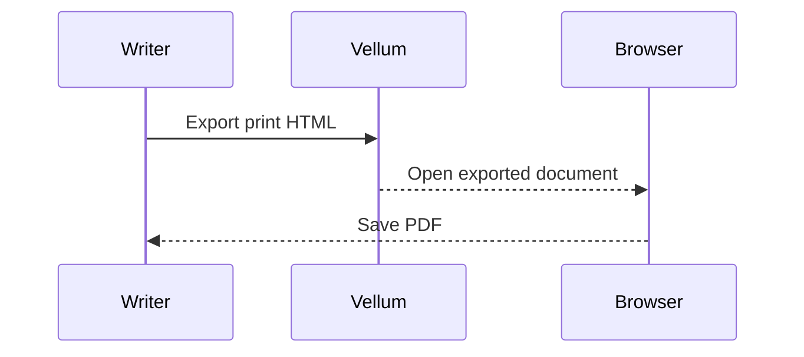

# Vellum Longform Acceptance

[toc]

## Draft Scope

This document is a compact end-to-end sample for longform writing. It exercises headings, outline entries, lists, tables, code, local images, inline math, block math, diagrams, footnotes, and a generated table of contents.


![Referenced local diagram][asset-diagram]

[asset-diagram]: assets/reference-diagram.svg "Referenced local diagram"

<picture>
  <source media="(min-width: 720px)" srcset="assets/cover.svg 1x, assets/reference-diagram.svg#workflow 2x">
  
</picture>

## Editing Blocks

- Draft the introduction.
- Review the outline.
- Export the finished article.

| Area | Expected behavior | Status |
| --- | --- | --- |
| Editor | Live preview keeps Markdown structure editable | Ready |
| Assets | Local image paths remain document-relative | Ready |
| Export | HTML includes copied local assets and print styles | Ready |

## Code Sample

```rust
fn export_status(ok: bool) -> &'static str {
    if ok {
        "ready"
    } else {
        "needs review"
    }
}
```

## Math Notes

Inline math should render in exported HTML: $E = mc^2$.

$$
\int_0^1 x^2 dx = \frac{1}{3}
$$

Aligned math should keep rows and alignment points readable in preview and export:

$$
\begin{aligned}
a^2 + b^2 &= c^2 \\
E &= mc^2
\end{aligned}
$$

## Mermaid Diagrams





## Footnote

The acceptance pass should verify that footnotes survive export and remain linked.[^acceptance]

[^acceptance]: This footnote checks GFM footnote rendering in the exported document.
