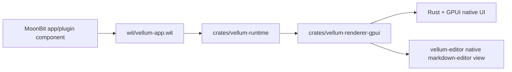

# Vellum Architecture

Vellum is moving from a Markdown editor with a separate extension system to a GUI framework built around MoonBit app components, Rust/GPUI native rendering, and WIT typed communication.

The current migration is incremental. The old Markdown editor and legacy extension host still exist, but the primary direction is the typed `vellum:app/app-world` protocol.

## System Shape



MoonBit owns application state and returns a typed `ViewTree`. Rust owns windowing, native rendering, file dialogs, event routing, host services, and native widget mounting.

## Repository Layout

```text
crates/
  vellum/                 # desktop host: window, menus, app startup, renderer wiring
  vellum-runtime/         # Wasmtime Component runtime, vellum.toml, lifecycle
  vellum-renderer-gpui/   # typed ViewTree -> GPUI renderer and UI event routing
  vellum-editor/          # facade for the existing Rust Markdown editor widget
  vellum-workspace/       # facade for existing workspace/file services
  vellum-extension-compat/# legacy extension-world compatibility facade
  editor/                 # existing editor implementation
  workspace/              # existing workspace implementation
  extension/              # existing legacy extension host implementation
  extension-sdk/          # legacy Rust extension SDK package

wit/
  vellum-app.wit          # canonical app/plugin typed UI protocol
  vellum-extension.wit    # legacy extension-world compat protocol
  legacy/                 # older experimental WIT files

moonbit/
  vellum-app-sdk/         # staging area for the new MoonBit app DSL
  vellum-plugin-sdk/      # staging area for the new plugin DSL/helpers
  demos/markdown-editor/  # main MoonBit app shell demo
  legacy-extensions/      # old MoonBit extension examples

examples/
  plugins/                # new typed plugin examples
  legacy-extensions/      # compatibility examples for old extension-world
```

## Core Crates

`crates/vellum` is the desktop host. It creates the GPUI window, manages menus and file dialogs, loads `VELLUM_APP` when set, and wires the framework renderer into the app view.

`crates/vellum-runtime` loads `vellum.toml`, instantiates WASM components with Wasmtime, exposes host services, and calls `init`, `update`, and `shutdown`.

`crates/vellum-renderer-gpui` renders typed `ViewTree` data into GPUI elements. It handles stable input state, routes UI events back to the runtime, and delegates `NativeView` mounting to the host.

`crates/vellum-editor` and `crates/vellum-workspace` are transition facades over the existing `editor` and `workspace` crates. They allow new framework crates and docs to use the `vellum-*` names without forcing a large code move in the same step.

`crates/vellum-extension-compat` preserves the old extension host API. New framework work should not add features to this path.

## Public Protocols

`wit/vellum-app.wit` is the canonical app/plugin protocol. It defines:

- lifecycle exports: `init`, `update`, `shutdown`
- typed `view-tree` and `view-node`
- typed UI events
- `native-view` nodes, with `kind = "markdown-editor"` implemented in v1

`wit/vellum-extension.wit` is compatibility-only. It keeps the old JSON panel payload protocol for existing examples and tests.

## Manifest

Framework apps and plugins use `vellum.toml`:

```toml
id = "vellum.demo.markdown"
name = "Vellum Markdown Demo"
version = "0.1.0"
kind = "app"
component = "target/wasm32-wasip2/release/vellum_markdown_demo.wasm"

[capabilities]
native_markdown_editor = true
filesystem = true
```

`kind = "plugin"` uses the same manifest and protocol. Plugin discovery and contribution mounting are planned on top of the same runtime instead of the old `extension.toml` path.

## Markdown Demo

The main demo is `moonbit/demos/markdown-editor`.

MoonBit describes the app shell and returns a `NativeView`:

```text
NativeView(id = "main-markdown-editor", kind = "markdown-editor")
```

Rust mounts the existing GPUI Markdown editor for that node. This keeps the complex WYSIWYG editor native while allowing the application shell, commands, panels, and future plugin UI to move to MoonBit.

## Compatibility Path

Legacy extension-world support remains available for migration:

- `crates/vellum-extension-compat`
- `crates/extension`
- `crates/extension-sdk`
- `wit/vellum-extension.wit`
- `moonbit/legacy-extensions`
- `examples/legacy-extensions`

This path is for compatibility and regression tests. New app and plugin work should target `wit/vellum-app.wit`.
