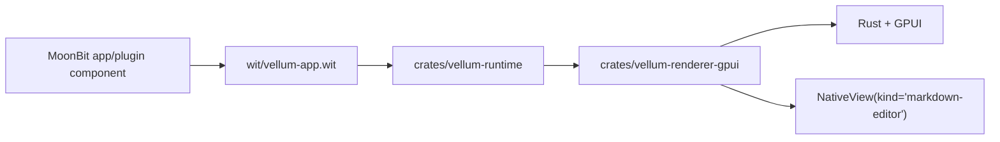

# Vellum Architecture

Vellum now treats `vellum:app/app-world` as the only framework protocol. MoonBit components own app and plugin state, Rust owns native rendering and services, and the Markdown editor stays native as a mounted `NativeView`.

## System Shape



`crates/vellum` is the desktop host. It boots the GPUI window, loads the MoonBit app pointed to by `VELLUM_APP`, manages plugin discovery, and bridges host services such as editor commands, editor snapshots, plugin enable/disable/reload, and status messages.

`crates/vellum-runtime` is the Wasmtime layer. It parses `vellum.toml`, instantiates app or plugin components, exposes host functions from `wit/vellum-app.wit`, and keeps typed state such as `ViewTree`, `EditorSnapshot`, and `PluginInfo`.

`crates/vellum-renderer-gpui` renders typed `ViewTree` nodes into GPUI elements. It keeps local input state stable across whole-tree refreshes and routes events back to either the app scope or a plugin-panel scope.

`crates/vellum-editor` and `crates/vellum-workspace` are facades over the existing Rust editor and workspace implementations. They let the new framework crates depend on stable `vellum-*` names while the underlying editor remains native Rust code.

## Repository Layout

```text
crates/
  vellum/                 # desktop host, windowing, menus, framework wiring
  vellum-runtime/         # Wasmtime component runtime and plugin store
  vellum-renderer-gpui/   # typed ViewTree -> GPUI renderer
  vellum-editor/          # facade for the native Markdown editor widget
  vellum-workspace/       # facade for workspace/file services
  editor/                 # existing editor implementation
  workspace/              # existing workspace implementation
  gpui-adapter/           # older GPUI adapter experiments

wit/
  vellum-app.wit          # canonical typed app/plugin protocol

moonbit/
  demos/markdown-editor/  # main MoonBit app demo
  vellum-app-sdk/         # MoonBit app helper package
  vellum-plugin-sdk/      # MoonBit plugin helper package
  vellum-gui-sdk/         # older experimental MoonBit GUI package

examples/
  plugins/counter/        # minimal typed plugin component example
```

## Protocol

`wit/vellum-app.wit` defines:

- lifecycle exports: `init`, `update`, `shutdown`
- typed `ViewTree` / `ViewNode`
- typed UI, native, command, and tick events
- host services for logging, status messages, render requests, editor commands, editor snapshots, and plugin management

Apps and plugins both use `vellum.toml`. `kind = "app"` boots the outer shell. `kind = "plugin"` contributes typed panels and commands that the host can mount into the app shell.

## Markdown Demo

`moonbit/demos/markdown-editor` is the current primary demo. Its MoonBit tree drives the shell layout and plugin sidebar. The editor surface is mounted from Rust through:

```text
NativeView(kind = "markdown-editor")
```

The same demo can mount a plugin panel through:

```text
NativeView(kind = "plugin-panel")
```

That gives us a single typed component model for both the app shell and plugins while keeping the WYSIWYG editor native.
