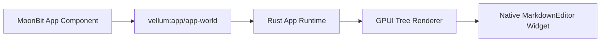

# Vellum GUI Framework Guide

Vellum is being migrated from a Markdown editor with a MoonBit extension layer into a MoonBit + Rust/GPUI GUI framework.

The v1 framework path is intentionally small and typed:

- MoonBit components own app state and produce a declarative UI tree.
- Rust loads the component with Wasmtime Component Model.
- GPUI renders the typed tree natively and routes UI events back to MoonBit.
- The existing Markdown editor remains Rust/GPUI code and is embedded as a `native-view` node.

## Current Architecture



The new WIT package lives at `crates/extension/wit/vellum-app.wit`.

The first implementation uses whole-tree replacement after each event. Stable node ids are still required because the Rust renderer keeps local GPUI state for controls such as text inputs.

## App Lifecycle

MoonBit apps export:

```wit
init: func(ctx: app-context) -> result<view-tree, app-error>
update: func(event: app-event) -> result<view-tree, app-error>
shutdown: func() -> result<_, app-error>
```

`init` returns the first `view-tree`. `update` receives a typed event and returns the next tree.

## UI Tree

`view-tree` is a flattened typed tree:

```wit
record view-node {
    id: string,
    kind: view-kind,
    children: list<u32>,
}

record view-tree {
    root: u32,
    nodes: list<view-node>,
}
```

The renderer currently supports:

- `column`
- `row`
- `text`
- `button`
- `input`
- `tabs`
- `split-view`
- `scroll-view`
- `native-view`

`native-view` supports `kind = "markdown-editor"` in v1.

## Manifest

Framework apps use `vellum.toml`:

```toml
id = "vellum.demo.markdown"
name = "Vellum Markdown Demo"
version = "0.1.0"
kind = "app"
component = "target/wasm32-wasip2/release/vellum_markdown_demo.wasm"

[capabilities]
native_markdown_editor = true
filesystem = true
```

## Run The Demo

Build the MoonBit component:

```bash
cd moonbit/vellum-gui-sdk/apps/markdown-demo
./build.sh
```

Launch Vellum with the MoonBit shell enabled:

```bash
cd /Volumes/Data/Code/Note/vellum
VELLUM_APP=moonbit/vellum-gui-sdk/apps/markdown-demo cargo run -p Vellum
```

Without `VELLUM_APP`, Vellum keeps running as the existing Rust Markdown editor.

## Notes

The old `vellum:extension/extension-world` path remains for compatibility during migration. New app work should target `vellum:app/app-world` and typed `view-tree`, not JSON panel payloads.
